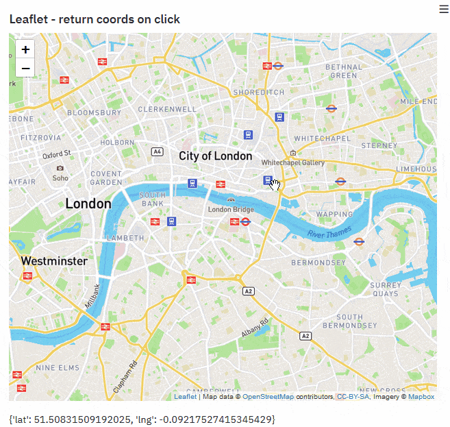

# Streamlit component - return coordinates on map click

A very quick & dirty prototype of Streamlit component that sends back coordinates on click, using the Reactless template. Feel free to fork and go on your Leaflet adventure!



## Quickstart

- Ensure you have [Python 3.6+](https://www.python.org/downloads/), [Node.js](https://nodejs.org), and [npm](https://docs.npmjs.com/downloading-and-installing-node-js-and-npm) installed.
- Clone this repo.
- Create a new Python virtual environment for the template:

```
$ cd template
$ python3 -m venv venv  # create venv
$ . venv/bin/activate   # activate venv
$ pip install streamlit # install streamlit
```

- Initialize and run the component template frontend:

```
$ cd template/my_component/frontend
$ npm install    # Install npm dependencies
$ npm run start  # Start the Webpack dev server
```

- From a separate terminal, run the template's Streamlit app:

```
$ cd template
$ . venv/bin/activate  # activate the venv you created earlier
$ streamlit run my_component/__init__.py  # run the example
```

- Modify the frontend code at `my_component/frontend/src/MyComponent.tsx`.
  - **Especially use your own Mapbox token ;)**
  - Height of div is also hardcoded, should be in separate css.
- Modify the Python code at `my_component/__init__.py`.

## What if I want to do it myself ?

```shell
git clone https://github.com/streamlit/component-template
cp -r component-template/template-reactless/ ~/streamlit-light-leaflet/
cd ~/streamlit-light-leaflet/my_component/frontend
npm add leaflet @types/leaflet
```

Then follow the Quickstart.

## More Information

- [Streamlit Components documentation](https://docs.streamlit.io/en/stable/streamlit_components.html)
- [Streamlit Forums](https://discuss.streamlit.io/tag/custom-components)
- [Streamlit Components gallery](https://www.streamlit.io/components)
- [Original issue](https://github.com/randyzwitch/streamlit-folium/issues/6)
